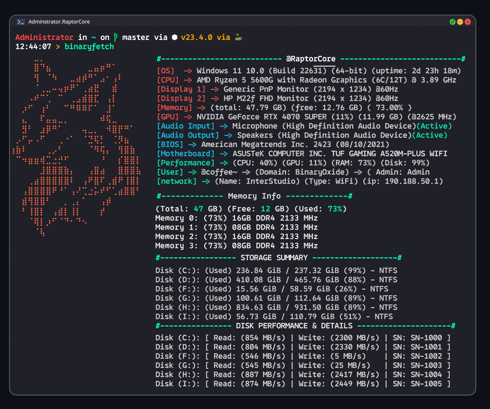

# BinaryFetch Prototype

> **Early-Stage UI/UX Design Prototype**  
> This repository contains the initial design prototype for BinaryFetch, showcasing layout concepts, UI flows, and structural elements.

---

## Overview

BinaryFetch is in its **conceptual design phase**. This prototype provides:

- Visual representation of the **interface layout**

- Mockups of **core components and screens**

- **Design patterns** and **spacing logic**

- Preliminary **color palette and branding elements**

> ⚠️ **Note:** This prototype is **not a working application** or functional codebase. It exists solely for **design evaluation, feedback, and planning**.

---

---

## Contents

The repository includes:

- **BinaryFetch.fig** — The primary Figma prototype file
  
  - Screen arrangements
  
  - Structural patterns
  
  - Color and typography exploration
  
  - Early branding elements

These visuals define the **initial design language** and serve as a **blueprint for future development**.

---

## Purpose

This prototype is intended for:

- **Documentation** of early design decisions

- **Educational insight** into interface planning

- **Feedback collection** and iterative improvements

It reflects ongoing experimentation and **may not represent the final product**.

---

## Rights & Restrictions

All content in this repository is the **intellectual property of Maruf Hasan** under the administration of **BinaryOxide**.

- No part of the design may be:
  
  - Copied
  
  - Redistributed
  
  - Modified
  
  - Republished
  
  - Used commercially or publicly

- **Reuse of brand names, UI assets, or structures is strictly prohibited.**

- Unauthorized usage may result in **takedown requests or copyright enforcement**.

---

## Usage Guidelines

This file and repository are strictly for:

- Viewing

- Study

- Feedback

> ❌ Functional replication, asset extraction, or redesign based on this prototype is **not allowed**.

---

## Continuous Updates

The BinaryFetch prototype is **actively evolving**. Future updates may include:

- Refined **UI elements**

- Improved **structural patterns**

- Enhanced **visual consistency**

- Additional **screens and flows**

Stay tuned for progressive updates as the project matures.

---

## Contact

For inquiries regarding the prototype, feedback, or permissions:

**Author:** Maruf Hasan  
**Administration:** InterCentury

